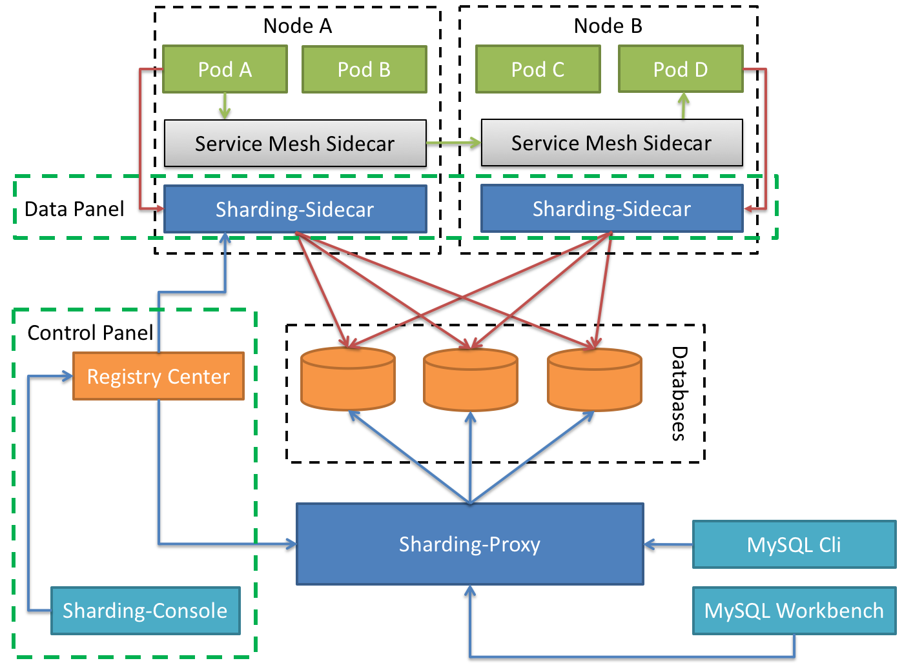

# ShardingSphere简介
> ShardingSphere分为ShardingSphere-JDBC、ShardingSphere-Proxy以及在研发中的ShardingSphere-Sidecar这三部分，
>在开发中我们使用ShardingSphere-JDBC来进行代码层面上的开发，帮助开发人员快速的进行分库分表的开发工作，
>ShardingSphere-Proxy主要是给DBA或者异构语言的场景进行使用。
## 1、ShardingSphere-JDBC
定位为轻量级 Java 框架，在 Java 的 JDBC 层提供的额外服务。 它使用客户端直连数据库，以 jar 包形式提供服务，无需额外部署和依赖，可理解为增强版的 JDBC 驱动，完全兼容 JDBC 和各种 ORM 框架。

- 适用于任何基于 JDBC 的 ORM 框架，如：JPA, Hibernate, Mybatis, Spring JDBC Template 或直接使用 JDBC。
- 支持任何第三方的数据库连接池，如：DBCP, C3P0, BoneCP, Druid, HikariCP 等。
- 支持任意实现 JDBC 规范的数据库，目前支持 MySQL，Oracle，SQLServer，PostgreSQL 以及任何遵循 SQL92 标准的数据库。

## 2、ShardingSphere-Proxy
定位为透明化的数据库代理端，提供封装了数据库二进制协议的服务端版本，用于完成对异构语言的支持。 目前提供 MySQL 和 PostgreSQL 版本，它可以使用任何兼容 MySQL/PostgreSQL 协议的访问客户端(如：MySQL Command Client, MySQL Workbench, Navicat 等)操作数据，对 DBA 更加友好。

- 向应用程序完全透明，可直接当做 MySQL/PostgreSQL 使用。
- 适用于任何兼容 MySQL/PostgreSQL 协议的的客户端。

## 3、ShardingSphere-Sidecar（内部开发中）
定位为 Kubernetes 的云原生数据库代理，以 Sidecar 的形式代理所有对数据库的访问。 通过无中心、零侵入的方案提供与数据库交互的的啮合层，即 Database Mesh，又可称数据库网格。

Database Mesh 的关注重点在于如何将分布式的数据访问应用与数据库有机串联起来，它更加关注的是交互，是将杂乱无章的应用与数据库之间的交互进行有效地梳理。 使用 Database Mesh，访问数据库的应用和数据库终将形成一个巨大的网格体系，应用和数据库只需在网格体系中对号入座即可，它们都是被啮合层所治理的对象。

## 4、ShardingSphere具体文档
ShardingSphere的详细的文档可以直接访问https://shardingsphere.apache.org/document/current/cn/overview/，以上地址的文档划分为以下几个大块来介绍ShardingSphere，大家可以仔细的研读相关的文档。
- 1、概览
- 2、快速入门
- 3、概念&功能
- 4、用户手册
- 5、开发手册
- 6、下载
- 7、FAQ